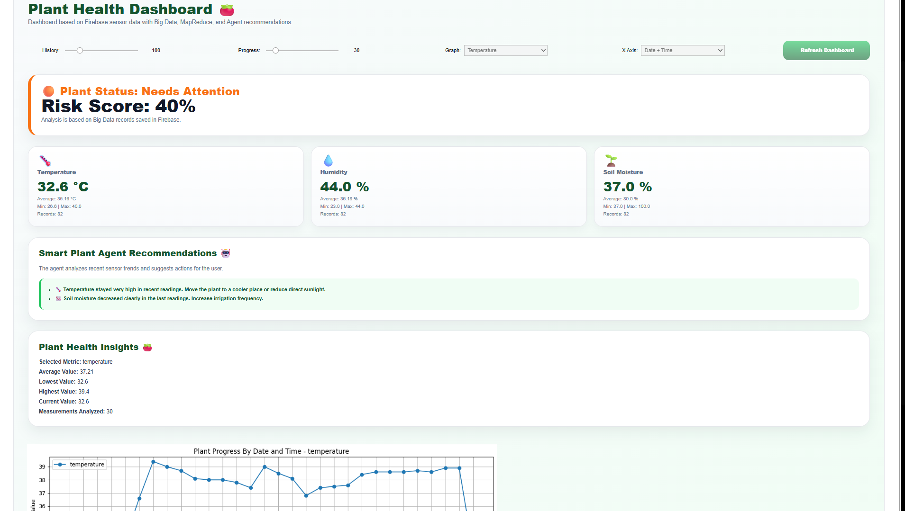
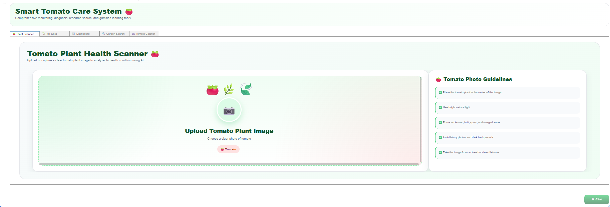
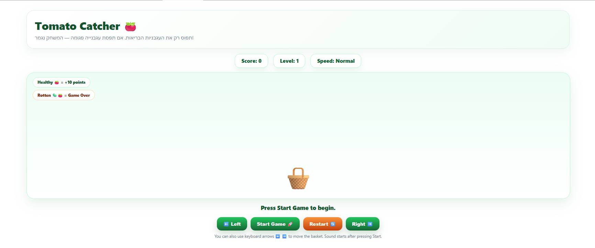
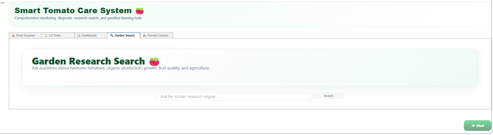
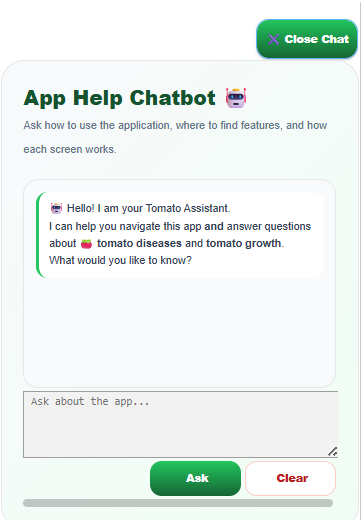

# 🍅 Smart Tomato Care

> **Growing Smarter, Harvesting Better.**

Smart Tomato Care is an AI-powered cloud computing platform that helps users monitor tomato plants, detect diseases, retrieve agricultural knowledge, and receive intelligent recommendations through an interactive dashboard.

The project integrates Artificial Intelligence, Cloud Computing, Internet of Things (IoT), Retrieval-Augmented Generation (RAG), and Google Gemini to provide a complete smart agriculture solution.

---

# 📸 System Preview

## 🏠 Dashboard



---

## 🌱 Plant Scanner

Upload a tomato plant image and automatically analyze its health using AI.



---

## 🍅 Tomato Disease Detection

Analyze uploaded tomato images and receive AI-powered disease detection and recommendations.



---

## 🔍 Garden Research Search

Search agricultural research articles using a custom-built search engine powered by an inverted index, TF-IDF ranking, and Retrieval-Augmented Generation (RAG).



---

## 🤖 AI Chatbot

An intelligent assistant powered by Google Gemini that answers user questions and provides guidance throughout the system.



---

## 📊 IoT Sensor Monitoring

Monitor environmental conditions including temperature, humidity, and soil moisture through an interactive cloud dashboard.


---

# ✨ Key Features

- 🍅 AI-powered tomato disease detection
- 🌱 Plant image analysis
- 🤖 Intelligent chatbot using Google Gemini
- 🔍 Agricultural search engine with RAG
- 📚 Custom inverted index
- 📄 TF-IDF document ranking
- ☁ Firebase Realtime Database integration
- 📊 IoT sensor monitoring dashboard
- 💡 AI-generated recommendations
- 📈 Interactive charts and visualizations
- 🖥 User-friendly interface

---

# 🛠 Technologies Used

- Python
- Google Colab
- Firebase Realtime Database
- Google Gemini API
- Scikit-learn
- Transformers
- Retrieval-Augmented Generation (RAG)
- TF-IDF Vectorizer
- Pandas
- Matplotlib
- Pillow (PIL)
- ipywidgets
- HTML & CSS

---

# 🏗 System Architecture

The platform consists of the following modules:

- Plant Scanner
- Tomato Disease Detection
- IoT Sensor Dashboard
- Agricultural Research Search Engine
- Retrieval-Augmented Generation (RAG)
- AI Chatbot
- Firebase Cloud Database

Together, these modules provide an intelligent cloud-based solution for tomato crop monitoring and disease diagnosis.

---

# 🚀 How to Run

## 1. Clone the Repository

```bash
git clone https://github.com/AyaSaeed10/Smart-Tomato-Care.git
```

Or download the repository as a ZIP file from GitHub.

---

## 2. Open the Notebook

Open the notebook:

```
Smart_Tomato_Care.ipynb
```

using **Google Colab**.

---

## 3. Connect to Google Colab Runtime

Click **Connect** in the top-right corner of Google Colab.

---

## 4. Install Dependencies

Run the first notebook cells to install all required Python libraries automatically.

---

## 5. Configure Google Gemini API

The chatbot requires a Google Gemini API key.

Replace the placeholder in the notebook with your own API key before running the chatbot module.

> **Note:** API keys are not included in this repository for security reasons.

---

## 6. Firebase Configuration

The project retrieves articles and sensor data from Firebase Realtime Database.

If you use your own Firebase project, update the Firebase database URL in the notebook accordingly.

---

## 7. Run the Notebook

From the Colab menu select:

```
Runtime → Run all
```

The notebook will automatically:

- Install required libraries
- Connect to Firebase
- Build or load the search index
- Initialize the RAG search engine
- Load the AI chatbot
- Launch the interactive application

---

## 8. Use the Application

Once the notebook finishes running, users can:

- Upload tomato plant images
- Detect tomato diseases
- View AI recommendations
- Search agricultural research articles
- Ask questions using the chatbot
- Monitor IoT sensor readings

---

# 📁 Repository Structure

```
Smart-Tomato-Care
│
├── Smart_Tomato_Care.ipynb
├── README.md
└── images/
    ├── dashboard.png
    ├── plant-scanner.png
    ├── tomato-catcher.png
    ├── garden-search.png
    ├── chatbot.png
    └── iot-sensor.png
```

---

# 🎯 Project Objectives

- Detect tomato plant diseases using Artificial Intelligence.
- Help users make informed agricultural decisions.
- Provide reliable research retrieval using RAG.
- Monitor environmental conditions using IoT sensors.
- Demonstrate the integration of AI and Cloud Computing in smart agriculture.

---

# 👩‍💻 Author

**Aya Saeed**

GitHub: https://github.com/AyaSaeed10

---

# 📄 License

This project was developed for educational and academic purposes.

---

⭐ **If you found this project useful, consider giving it a star!**
